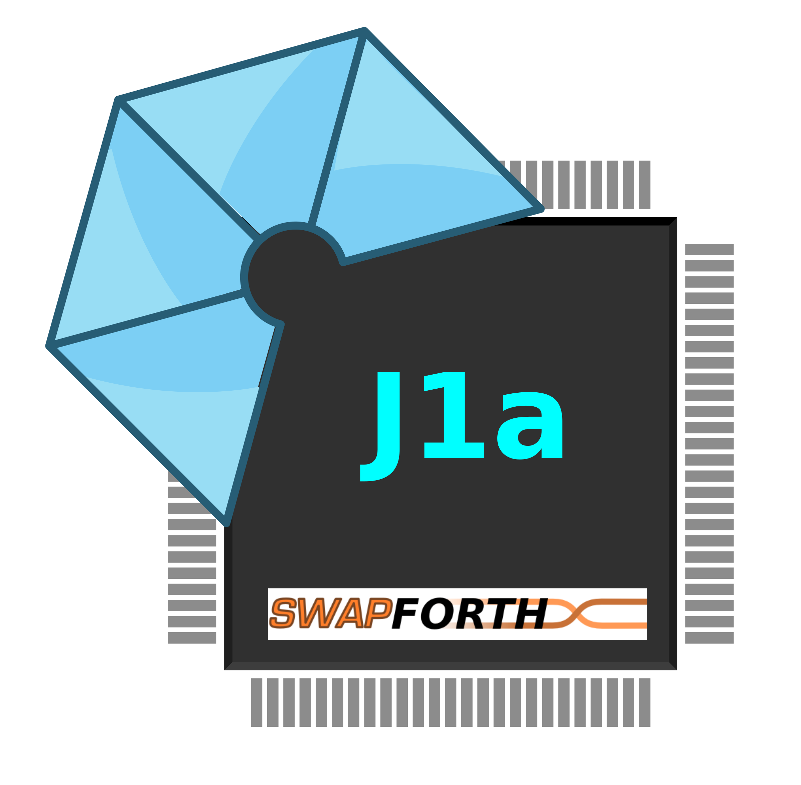
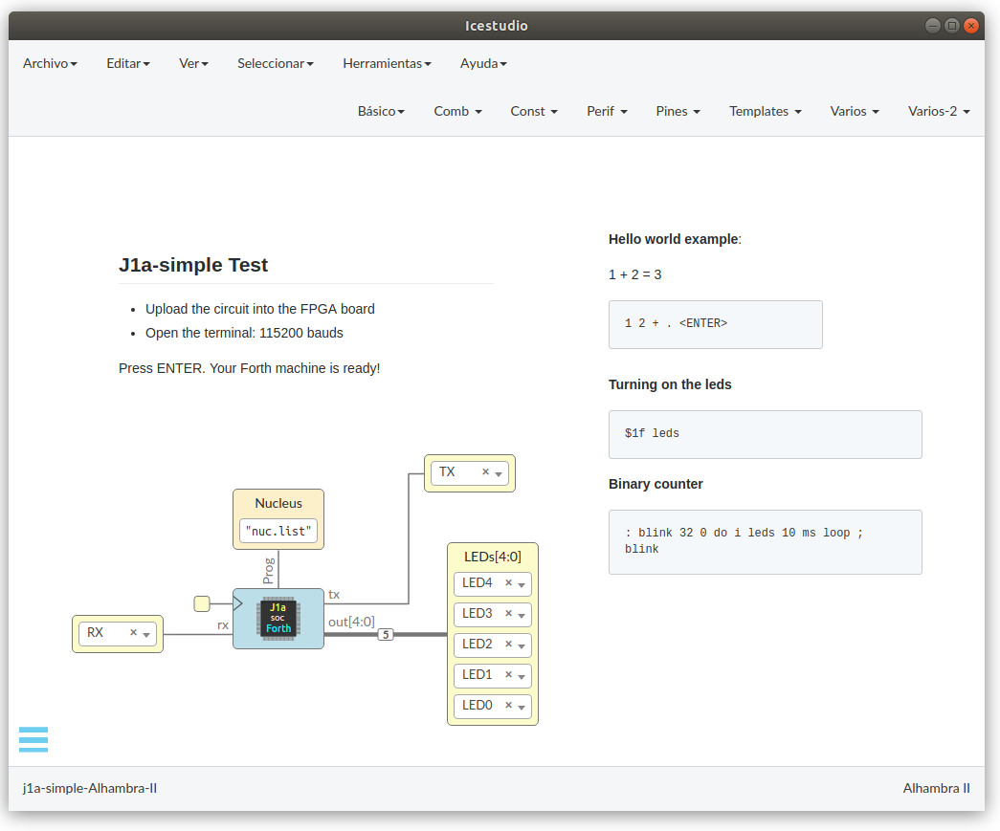

# SwapForth J1a-ICestudio
  SwapForth J1a processor for Icestudio

Use the [J1a Forth processor](https://www.excamera.com/sphinx/article-j1a-swapforth.html) very easily!

The j1a-simple is a modified version of the J1a:
* It can be opened with the [Icestudio](https://icestudio.io/) open source visual editor
* Baudrate: 115200
* Clock frequency: 12Mhz (no PLL)
* No DTR used

It can be synthesized on any of the supported boards with **OpenFPGAs**, althout in this repo there are only example for the following boards:  
  * [Alhambra II](https://github.com/FPGAwars/Alhambra-II-FPGA/wiki)
  * Icestick

## Quick start

* Open the **j1a-simple-Alhambra-II.ice** file with Icestudio (5.1 or higher). Depending on the board, it is located in the folders j1a-AlhambraII or j1a-icestick (if you have another board just choose anyone and change the input/outpus)




* Connect the Alhambra-II board (or compatible board) and upload the design
* Open a serial terminal (115200 bauds) (You can use the one available inside icestudio (0.5.1-dev or higher) or an external one)
* Press the ENTER key. You will see the **ok message**
* Your Forth environment is ready!!

## Hello world examples!

From the terminal, type the following Forth examples:

* Calculating 1 + 2

```
1 2 + .
```

* Turning on the leds

```
$1f leds
```

* Binary counter

```
: counter 32 0 do i leds 10 ms loop ;
counter
```

### Vídeo

[](https://www.youtube.com/watch?v=KoiPz8ke7vM)


### Testing the firmaware in C

* go to the firmware/soc-demo/src-c folder
* Execute make (It is assumed that you already have the risc-v tools installed)
* You should see a binary counter in the LEDs
* If you open a serial terminal (115200 bauds) you will see messages


* In this [youtube video](https://www.youtube.com/watch?v=mv1SFoqzZWY) you can see it in action!


* Pressing the "1" key will reset the counter and show the intial message again


### Testing the firmware in asm

* go to the firmware/soc-demo/src-asm folder
* Execute make
* You should see a value in the LEDs

## Credits

It is based on the picorv32 by Clifford Wolf
https://github.com/cliffordwolf/picorv32

## SOCs for the RARs simulator

There are two socs for using with the RARs simulador:
* soc-rars-MMIO-1-port.ice: It have no uart and 1 output port at address 0xFFFF0000, connected to the LEDs
* soc-rars-MMIO-2-ports.ice: The previous soc plus one additional output port, connected to the D0-D7 pins in the Alhambra II board

In the firmware/soc-rars-MMIO-1/rars and firmware/soc-rars-MMIO-2/rars folderS there are examples for trying. Open them with the RARs simulator, assemble and dump the code into a .bin file. Then flash it into the FPGA with iceprog tool:

```
iceprog -o 1M file.bin
```


# j1a-icestudio
SwapForth J1a processor for Icestudio
